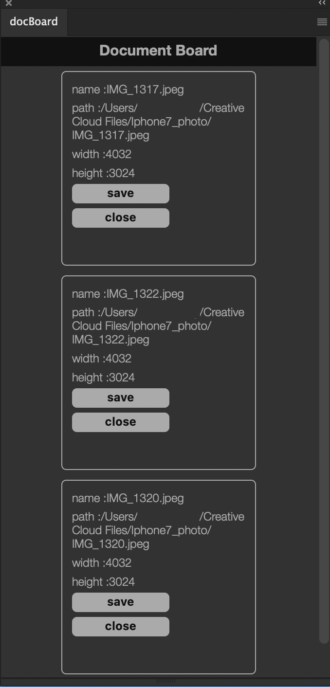
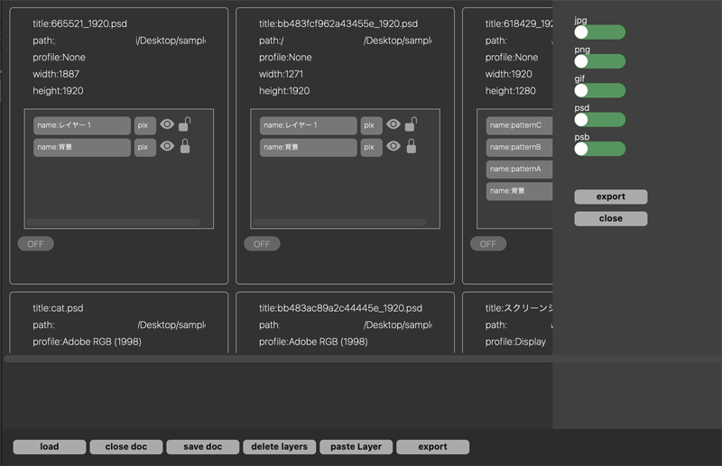

# Photoshop UXP Document Board

    this is a simple Photoshop UXP Plugin.
    opening a lot of file on Photoshop makes mess your work environment.
    the panel shows files info and you can activate file from panel.

### how does panel list files

    just start the panel and then panel going to list opened file on Photoshop automatically
    when you open file or close ...etc

### other features

1. click file's tab. and it activates file you selected
2. click save button. it saves file you selected
3. click close button. it closes file you selected

## detail panel

the panel loads document's data. and it has features like export images as a gif or jpe , delete layers.
these functions are below.

### displaying detail of document.

this panel shows detail of all documents on Photoshop.  
the panel loads document's data automatically when you close document or open some other document.

1. **name** name of the document
2. **path** path of the document
3. **profile** color profile
4. **width** document's width
5. **height** document's height
6. **layers** document's layer's detail

### layer's data

1. **name** name of the layer.
2. **kind** kind of the layer.(it only shows three latters)
3. **visible** the layer is hided or showed.
4. **lock** the layer is locked or not.

and also you can check documents and layers for some functions .

### close doc
closing documens you checked.

### save doc
saving documents you checked.

### delete layers
deleting layers you checked.

### paste layer
the layer copied on clipboard will be pasted on the document you checked.

### how install it
git clone this plugin and read manifest.json through Adobe UXP developer tool.

### export
exporting images.  
you choice directory you want to export images you checked.
and it exports images as a psd or jpg or gif etc...

**[Japanese explanation is ](https://kawano-shuji.com/justdiary/2021/07/01/photoshop-uxpplugin-documentboard/)here**

8 August 2021 update all save feature